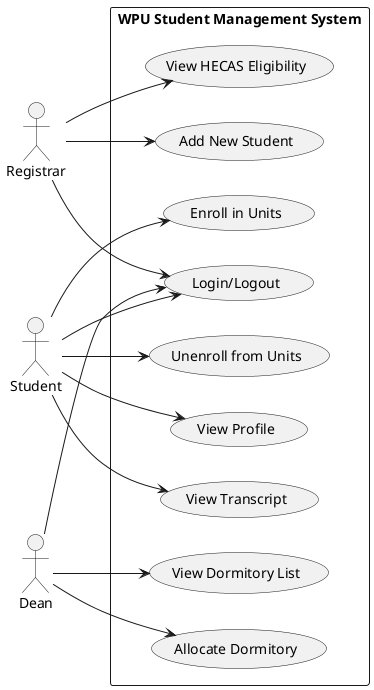

## WPU Student Management System - Use Case Overview

Actors:
- Registrar Staff
- Student
- Student Service Staff (Dean)

Key Use Cases:
- Registrar: Login/Logout, Add New Student, View HECAS Eligibility
- Student: Login/Logout, View Profile, View Transcript, Enroll in Units, Unenroll from Units
- Dean: Allocate Dormitory, View Dormitory List

UML Use-Case Diagram (PlantUML):

Notes:
- This demo uses localStorage for data persistence. Replace with a backend service and the provided `WPUniversitydb.sql` for production.

